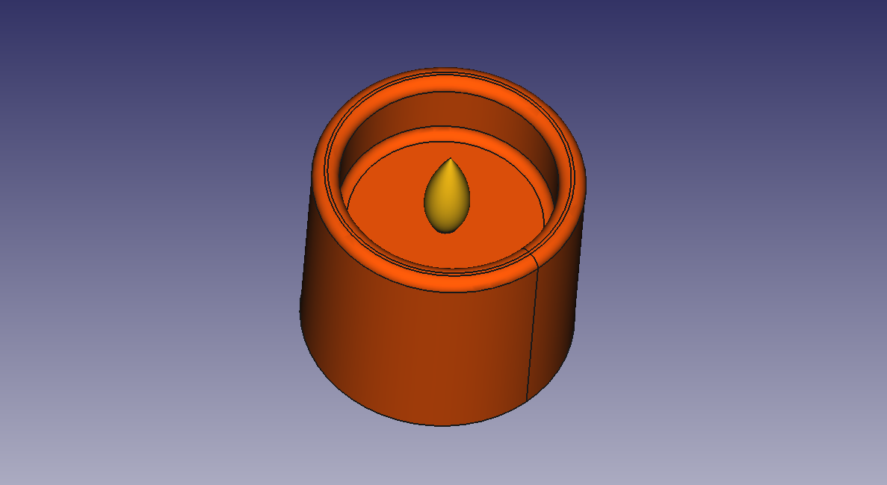
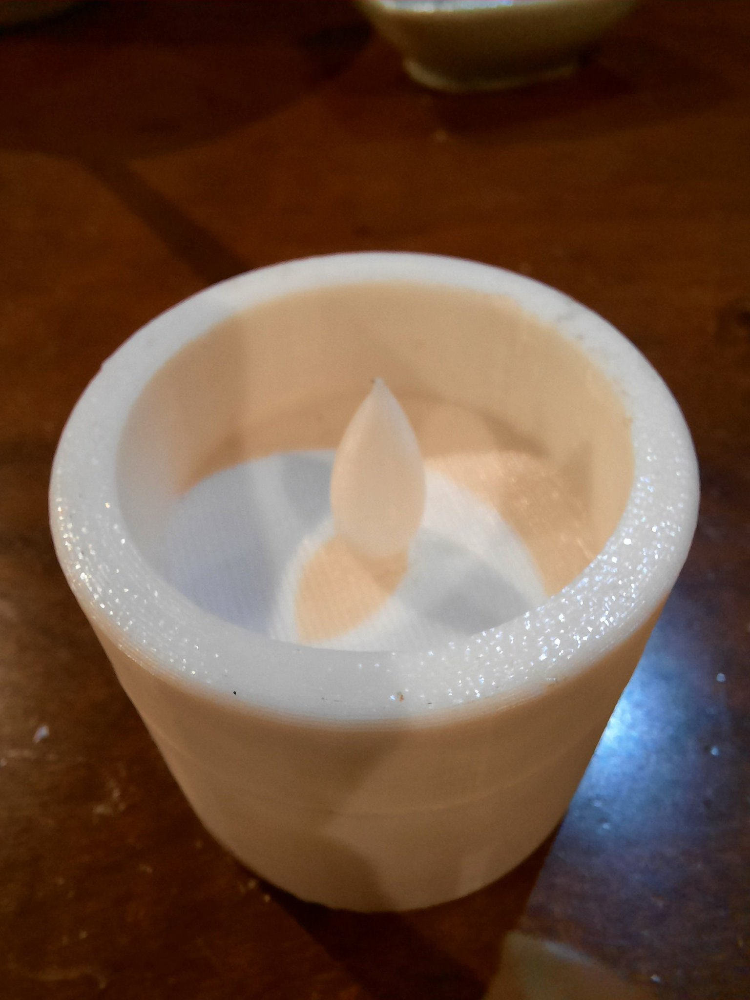
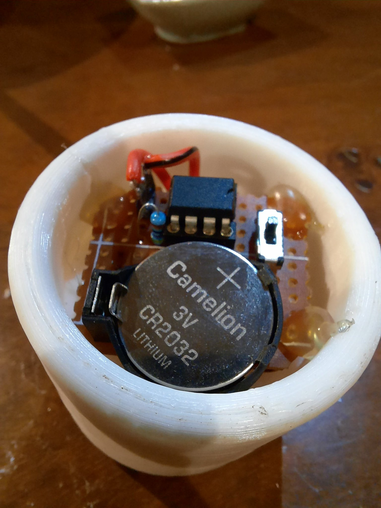

# LED candle

A simple LED candle using ATTiny AVR MCUs.






## Building

```console
pio run
```

or building a specific target

```console
pio run -e attiny13a
```

## Build flags

### White noise

`-D USING_WHITE_NOISE` uses `rand()`, instead of "pink" noise, for changing
the duty. Requires more flash memory.

### Floating point math

`-D USING_PINK_NOISE_FLOAT` uses floating point math version of `pink_noise()`.
Requires more flash memory.

## Debugging

```console
pio debug -e attiny13a --interface=gdb -- -x init
```

# LICENSE

MIT. See [LICENSE](LICENSE).

[tiny_random.c](src/tiny_random.c) and [tiny_random.h](src/tiny_random.h) are
licensed under 3-clause BSD license.
